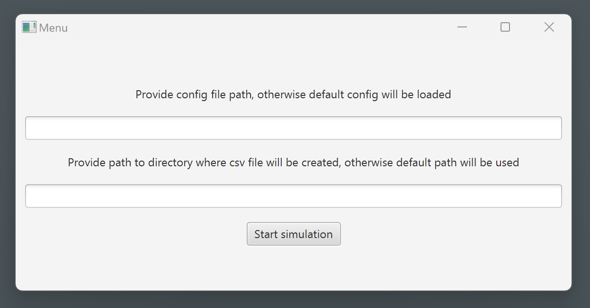
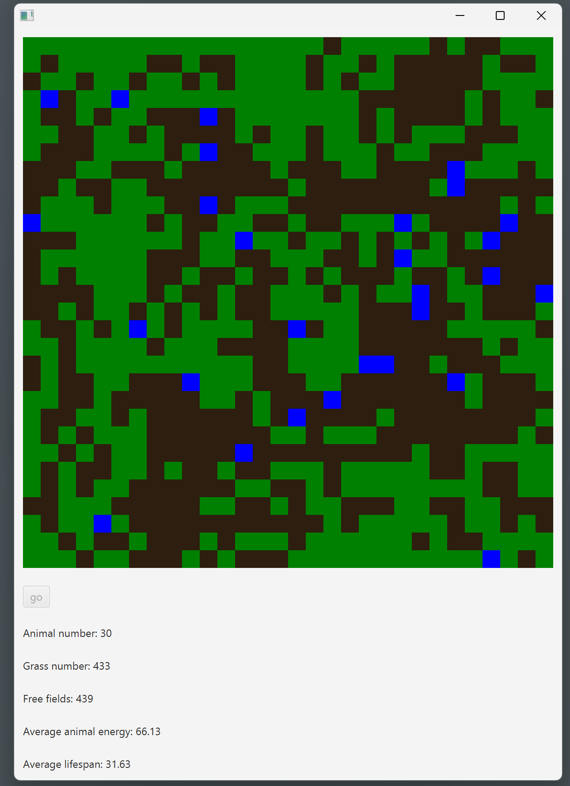

# Evolution Simulator
This project was made withing the subject of Object-Oriented Programming at AGH UST.
It performs a simple evolution simulation, where animals are moving on the map using their energy, eating grass, and reproducing if their energy allows so.
The app allows configuration of the simulation by a text file. Simulation statistics are aggregated and displayed live during the simulation.
There are some additional features that are not implemented yet.
## Screenshots

